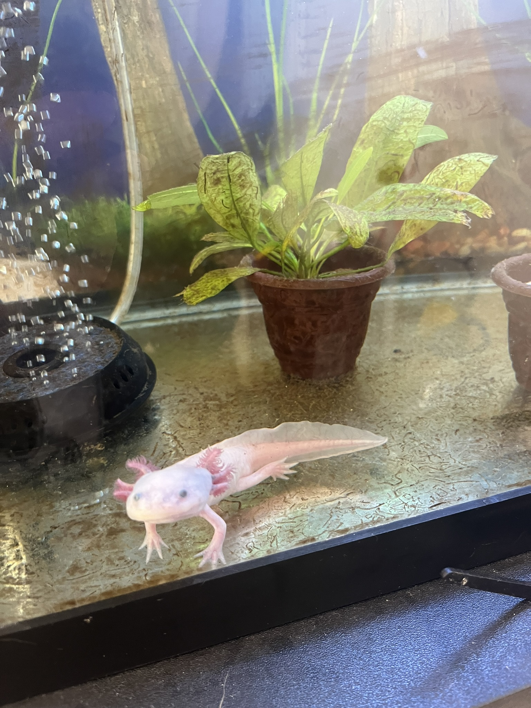
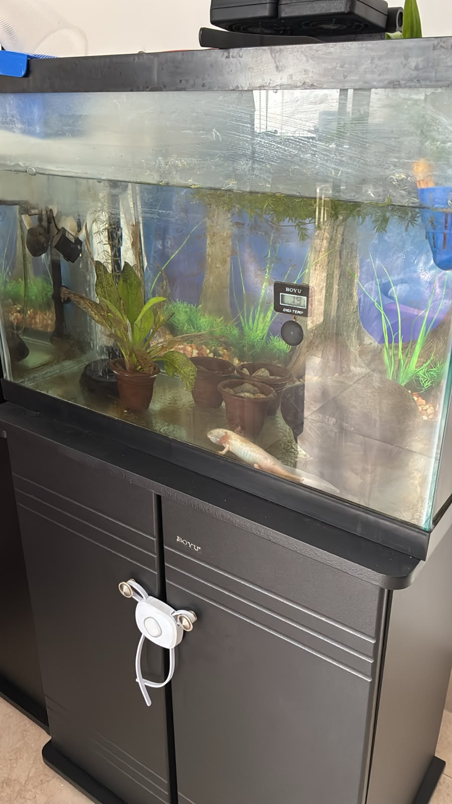
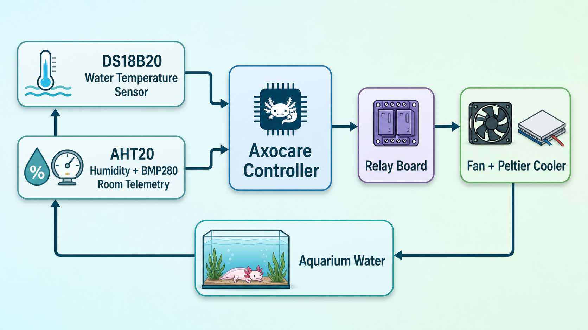
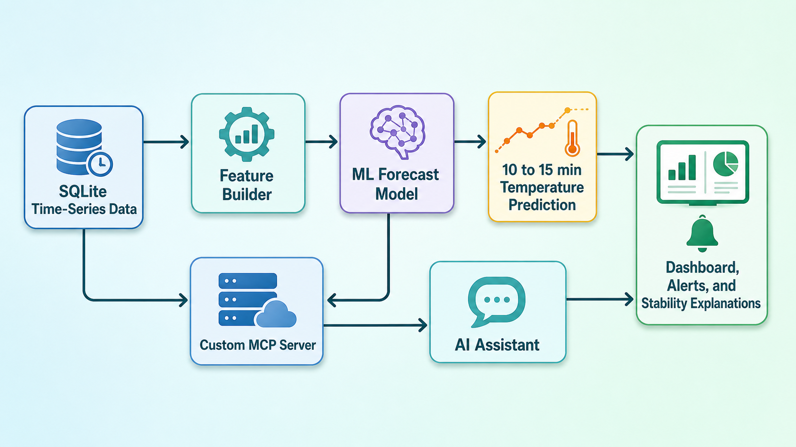

<!-- _class: lead -->

# Axocare Temperature Control

## Why predictive ML is useful for axolotl safety

---

## Introduction

- **Goal:** keep axolotl water stable and cool, not just react after drift appears
- **System:** Raspberry Pi + water sensor + ambient telemetry + relay-driven fan/Peltier cooling
- **Idea:** combine physical intuition with a data-driven short-term temperature predictor

---

## Why temperature control matters for axolotls

- Axolotls are cold-water amphibians and prolonged warm water increases **stress, low appetite, and disease risk**
- Temperature rises are often **slow and easy to miss**, especially across warm afternoons or nights
- A controller that only reacts to the current reading can still be **late** when the tank is already drifting upward
- Predicting the next **10 to 15 minutes** helps Axocare act earlier and explain whether the tank is becoming unstable

---

## Control loop

---

## AI and prediction flow

---

## Analytic heat model of the tank

For a simplified lumped system, water temperature can be modeled as:

$$
C_w \frac{dT_w}{dt} = U_a \left(T_{room} - T_w\right) - \eta_{cool}(H)\,u(t)\,P_{cool}
$$

Where:

- $C_w = m_w c_p$: thermal capacity of the aquarium water
- $T_w$: water temperature, $T_{room}$: room temperature
- $U_a$: effective heat transfer from room to tank
- $u(t)$: cooling command, 0 or 1 from the relay
- $P_{cool}$: nominal cooling power
- $\eta_{cool}(H)$: cooling efficiency, which may change with **humidity** and ambient conditions

---

## Why an analytic-only solution is hard

- **Water volume changes** alter $mw$, so the same cooling action can produce a different temperature response
- **Humidity and airflow** can change fan and Peltier performance, which makes $\eta_{cool}$ non-constant
- Real tanks also include **glass losses, pump mixing, room cycles, and sensor lag**
- Many parameters are **unknown, drifting, or hard to measure online**
- That means a fixed equation can be elegant, but often becomes **fragile when the real setup changes**

---

## Why ML is better here

- The ML model learns directly from **historical telemetry**, not from assumed fixed coefficients
- It can use signals already collected by Axocare: `temperature_c`, `relay_on`, `room_temperature`, `aht20_humidity_percent`, recent lags, averages, and slopes
- Instead of estimating one perfect $Ua$, $Cw$, and $\eta_{cool}$, it learns the **effective behavior** of the full system
- This makes it more robust to variable water volume, humidity-dependent cooling efficiency, daily room cycles, and gradual hardware changes

---

## How AI integrates through the custom MCP server

- Axocare includes a **custom MCP server** that gives an AI assistant structured access to aquarium data and model outputs
- Instead of guessing from raw text, the assistant can query **recent telemetry, forecasts, and system status** as tools
- This makes AI useful for tasks like:
  - explaining whether the tank looks stable
  - answering natural-language questions about recent behavior
  - surfacing early warning signs from the ML forecast
- The MCP layer connects the local database and prediction pipeline to an AI interface while keeping the system **local and grounded in real measurements**

---

## Chosen ML model: thermal ridge regression

- **What it is:** a small regression model that learns from recent temperature, relay, and ambient readings
- **Why it fits:** the aquarium is a slow thermal system, so we do not need a large complex model for 10 to 15 minute forecasts
- **Why ridge:** regularization keeps the prediction stable when data is limited and features are correlated
- **Practical benefit:** fast to train, fast to run, and easy to explain on a Raspberry Pi

---

## Best approach: physics-guided ML

- The analytic model is still valuable because it tells us the **right causal structure**
- The ML layer is better for **short-horizon prediction** because it adapts to real operating data
- In practice, Axocare can use ML to answer: Will the water likely rise in the next 10 to 15 minutes? Is cooling having the expected effect right now? Does the system look stable or is it drifting toward risk?
- This gives a safer and more explainable controller for axolotl care

---

## Takeaway

- Axolotl health depends on **stable, cool water**
- A pure analytic model is useful, but its parameters vary with the real aquarium
- A short-horizon ML predictor turns Axocare from a reactive controller into a **predictive monitoring system**
- That helps the project handle real-world variability while staying lightweight enough to run locally on the Raspberry Pi

---

## Thank you!!

Repository link: [TavoJG/Axocare](https://github.com/TavoJG/Axocare)